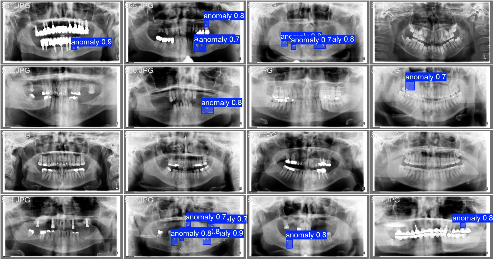
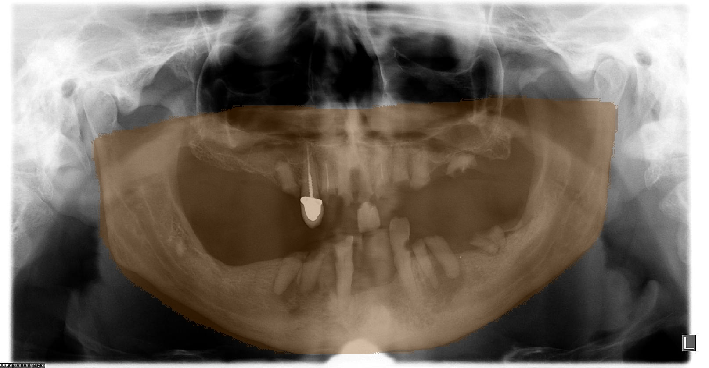
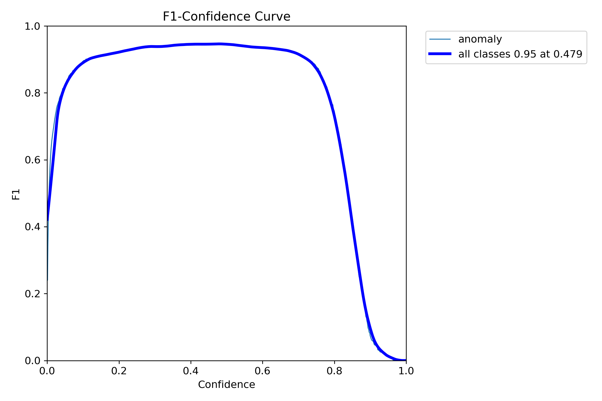
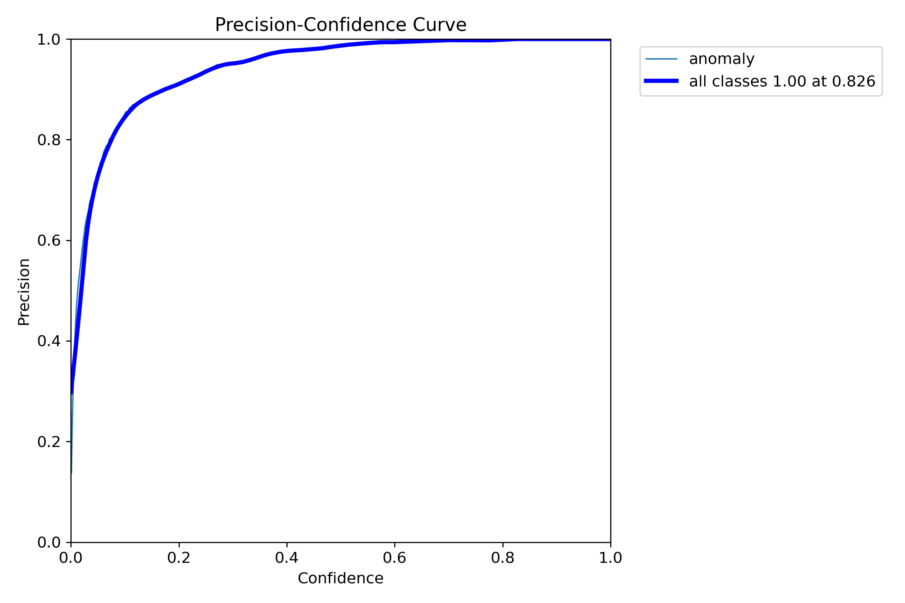
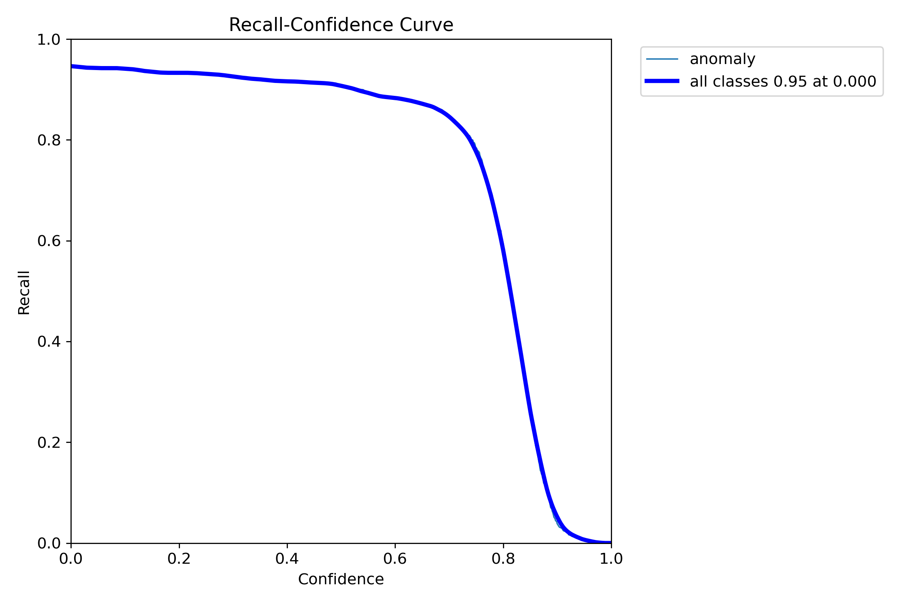
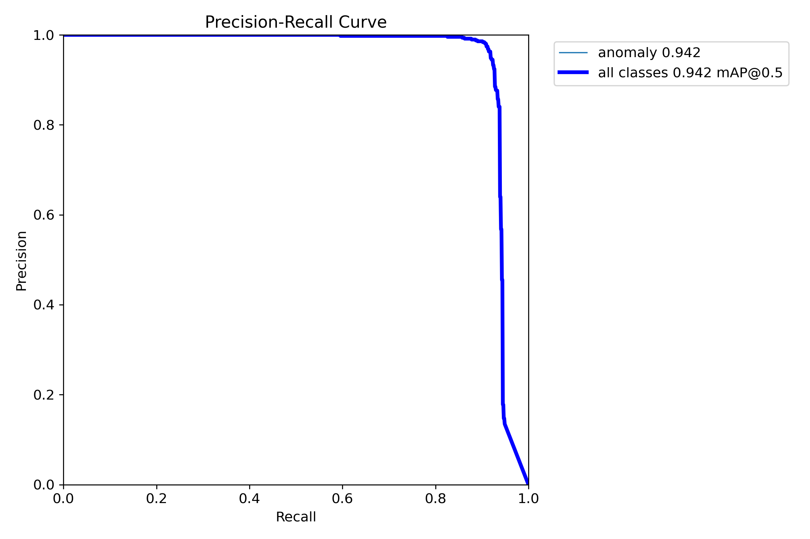
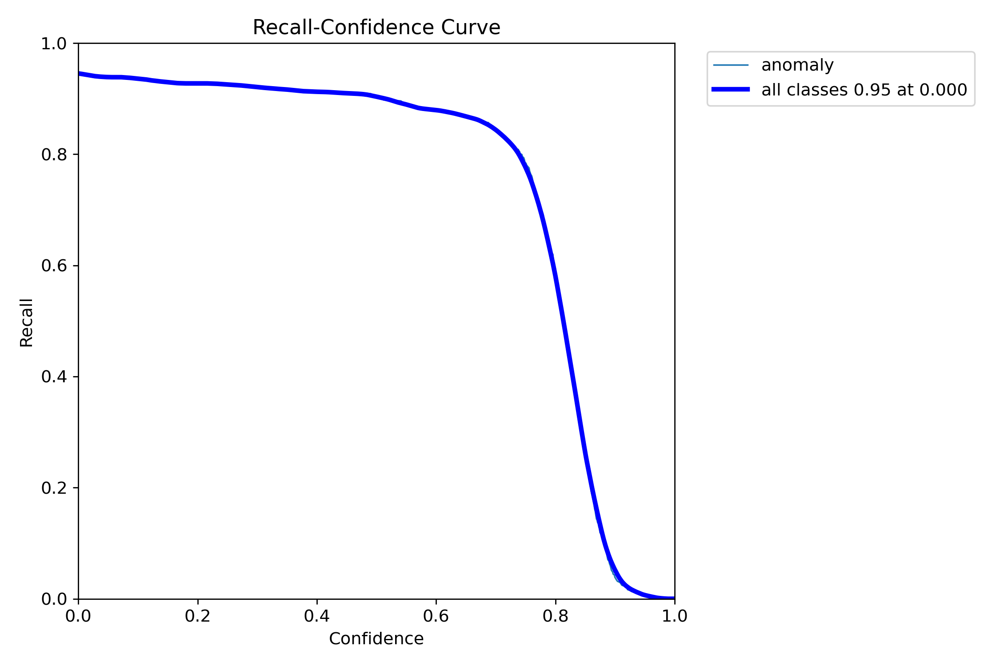
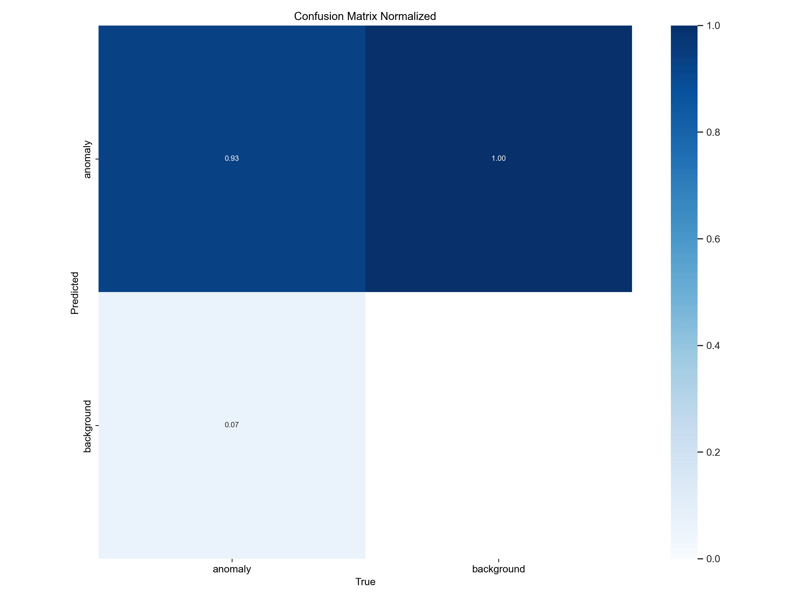
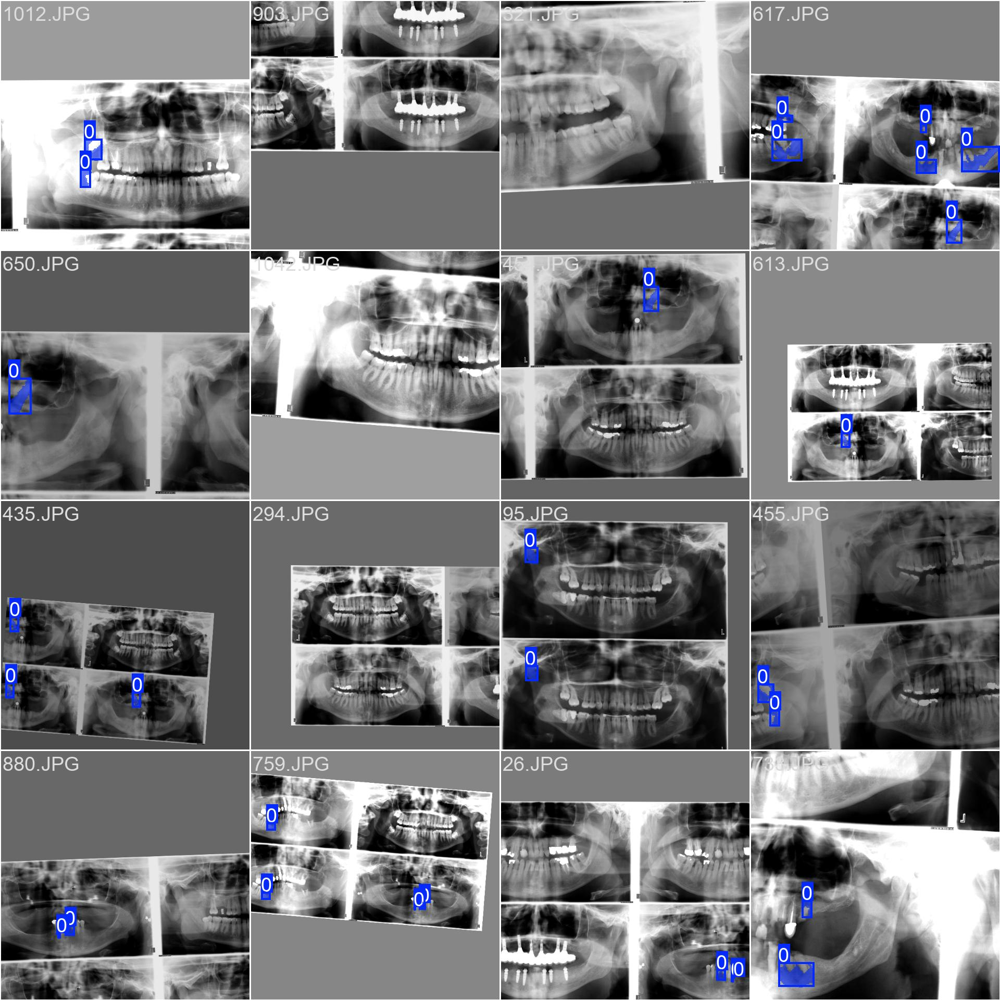
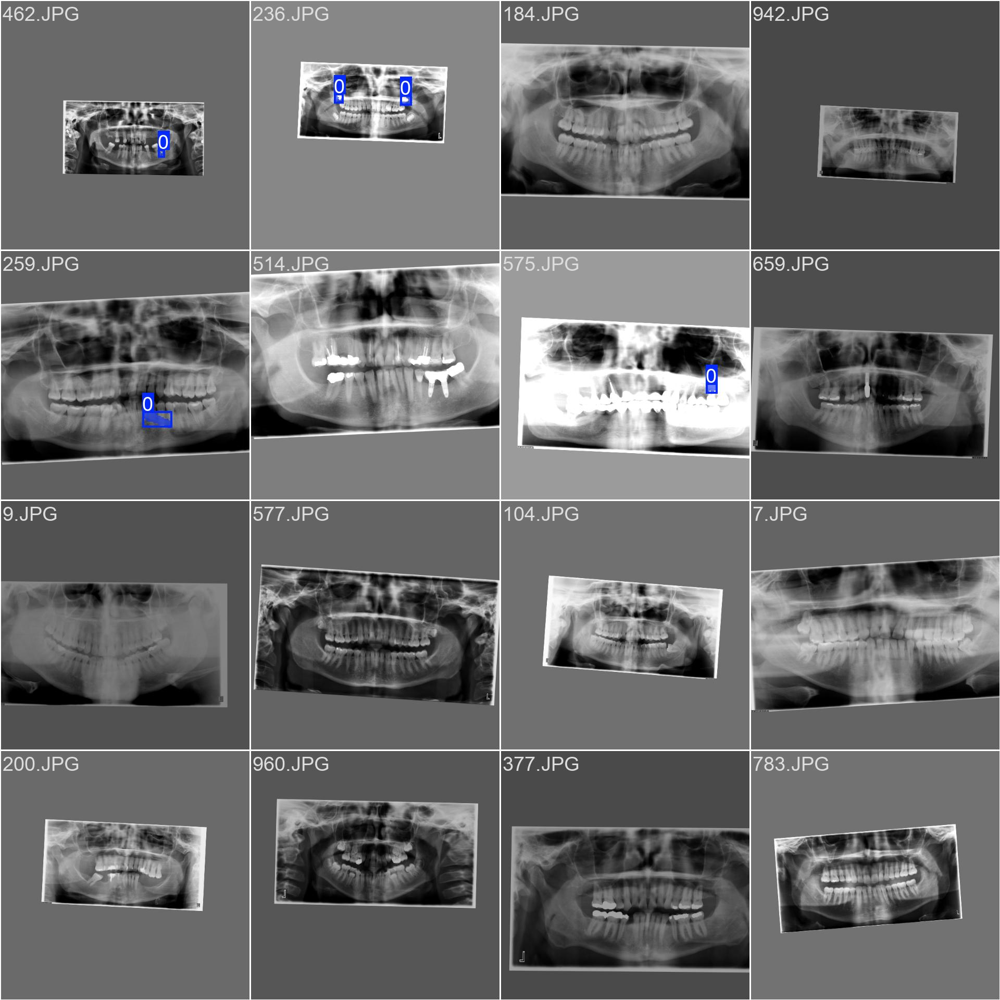

# Dental Anomaly Detection using YOLOv8 Segmentation
- 

This project uses the **Tufts Dental Database: A Multimodal Panoramic X-Ray Dataset** to detect dental anomalies such as missing teeth, implants, or lesions using a YOLOv8-based pipeline combining both object detection and mask segmentation. We have reported the performance of our model which is greater then some of the best reported acadmeic work on TUFTS dataset.

---

## 📚 Project Overview

<strong>Our pipeline involves four sequential processing steps:</strong>

<table>
  <tr>
    <td style="vertical-align: top; padding: 10px;"><strong>1. Maxillomandibular Region Detection</strong> 
      Isolating the region of interest in the panoramic scan.
    </td>
    <td style="text-align: center; padding: 10px;">
      
    </td>
  </tr>
  <tr>
    <td style="vertical-align: top; padding: 10px;"><strong>2. Tooth Segmentation</strong> 
      Extracting the tooth structures from the X-ray for individual inspection.
    </td>
    <td style="text-align: center; padding: 10px;">
      
    </td>
  </tr>
  <tr>
    <td style="vertical-align: top; padding: 10px;"><strong>3. Anomaly Detection</strong> 
      Identifying and segmenting anomalies within the detected teeth regions.
    </td>
    <td style="text-align: center; padding: 10px;">
      
    </td>
  </tr>
</table>

## 📦 Dataset

**Source**: [Tufts Dental Database](https://arxiv.org/abs/2312.06226)

**Details**:
- Panoramic dental X-rays (high resolution)
- Annotated anomalies under the class label: `anomaly`
- Available in YOLO format for bounding boxes and polygon format for segmentation
- Distribution visualization: The image below shows the distribution of our labeled bounding box dataset. 

---
## 🧠 Model Pipeline

| Task               | Model     | Description                                      |
|--------------------|-----------|--------------------------------------------------|
| Object Detection   | YOLOv8    | Detect bounding boxes around anomalies          |
| Mask Segmentation  | YOLOv8-seg| Segment anomalies within detected regions       |

---

## 🏋️‍♂️ Training Overview
We have fine tuned the Yolox model for 200 epochs on TUFTS dataset with training observation as shown in the image below.

- **Epochs**: 200
- **Losses**: Classification, Box, Segmentation, and Distribution Focal Loss (DFL)
- Training and validation loss curves show strong convergence:

---

## 📊 Evaluation Metrics

### 📈 Detection and Segmentation Metrics

| Metric          | Detection (Box) | Segmentation (Mask) |
|------------------|------------------|----------------------|
| mAP@0.5          | 0.946            | 0.942                |
| F1 Score (Max)   | 0.95 @ 0.479     | 0.95 @ 0.478         |
| Precision (Max)  | 1.00 @ 0.826     | 1.00 @ 0.826         |
| Recall (Max)     | 0.95 @ 0.000     | 0.95 @ 0.000         |

---
## 📊 TUFTS comparison

| Metric               | Our Model  | Tufts Paper (Benchmark) |
|----------------------|------------|--------------------------|
| mAP@0.5 (Detection)  | **0.946**  | ~0.82 (YOLOv5s)          |
| mAP@0.5 (Segmentation)| **0.942** | ~0.84 (ResNet-FCN)       |
| Max F1 Score         | 0.95       | N/A                      |
| Max Precision        | 1.00       | N/A                      |
| Max Recall           | 0.95       | N/A                      |

🔍 Our process  outperforms both the YOLOv5s and FCN baselines reported in the Tufts paper.

### 📉 Precision, Recall & F1 Curves
<!-- Bounding Box Metrics -->
**Bounding Box Metrics**
<table>
  <tr>
    <td style="text-align: center;">
      
F1 vs Confidence:

      
    </td>
    <td style="text-align: center;">
      
Precision vs Confidence:

      
    </td>
    <td style="text-align: center;">
      
Precision-Recall Curve:

      
    </td>
    <td style="text-align: center;">
      
Recall vs Confidence:

      
    </td>
  </tr>
</table>

<!-- Mask Segmentation Metrics -->
**Mask Segmentation Metrics**
<table>
  <tr>
    <td style="text-align: center;">
      
F1 vs Confidence:

      
    </td>
    <td style="text-align: center;">
      
Precision vs Confidence:

      
    </td>
    <td style="text-align: center;">
      
Precision-Recall Curve:

      
    </td>
    <td style="text-align: center;">
      
Recall vs Confidence:

      
    </td>
  </tr>
</table>

---

## 📊 Confusion Matrix

  

    
Raw Confusion Matrix:

    
  

  

    
Normalized Confusion Matrix:

    
  

**Insights**:
- 93% of anomalies were correctly predicted.
- Background misclassifications were minimal, indicating strong class separation.

---

## 💡 Key Observations

- **Excellent F1 Scores** (0.95) at moderate confidence thresholds.
- **Perfect precision** (1.0) achieved at high confidence, indicating highly trustworthy predictions.
- **High mAP@0.5** for both detection and segmentation proves the model’s capability to localize and delineate anomalies effectively.
- Confusion matrix confirms minimal false positives and false negatives.
- Label distribution is reasonably balanced and spatially consistent across the dataset.

---

## 🧪 Sample Visualizations

### 📦 Ground Truth (Train)
<table>
  <tr>
    <td style="text-align: center;">
      
    </td>
    <td style="text-align: center;">
      
    </td>
  </tr>
</table>

### 🧾 Ground Truth Labels (Validation)
- 

### 🧠 Model Predictions (Validation)
- 

---

## 🚀 Future Scope

- Introduce multi-label anomaly classification (e.g., caries, implants).
- Build anomaly progression tracking over time from X-ray series.
- Explore 3D reconstruction or CT-assisted learning.

---

## 🛠️ Tools & Frameworks

- **YOLOv8**: Ultralytics
- **Python**: Data preprocessing, training
- **OpenCV + Matplotlib**: Visualization
- **Pandas/Numpy**: Data analysis

---

## 📌 Conclusion

This project demonstrates the viability of deep learning-based anomaly detection in dental radiography using object detection and segmentation techniques. With near-perfect precision and robust recall, this system can significantly assist dental practitioners in early diagnosis and treatment planning.
